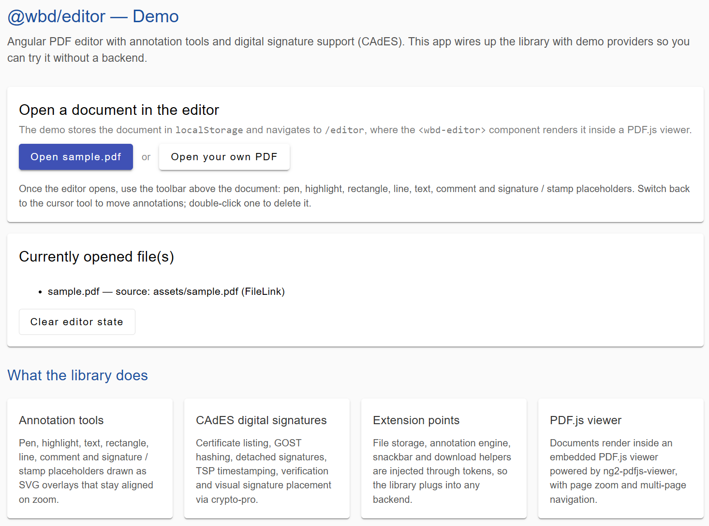

# @wbd/editor
<p align="left"> <a href="readme/README.ru.md">🇷🇺 Документация на русском</a> </p>
> Angular PDF editor library with annotation and digital signature (CAdES) support.

<p align="left">
  <i>Developed by <strong><a href="https://weldbook.ru">Weldbook</a></strong></i>
</p>

<p align="left">
  <a href="https://weldbook.ru" target="_blank">
    
  </a>
</p>


<p align="center">
  
</p>

[](https://www.npmjs.com/package/@wbd/editor)
[](LICENSE)
[](https://angular.dev)
[](CONTRIBUTING.md)

`@wbd/editor` renders PDF documents in an embedded [PDF.js](https://mozilla.github.io/pdf.js/)
viewer and provides a complete annotation toolbar plus a digital-signature
pipeline built on top of [CryptoPro](https://cryptopro.ru/) (CAdES).

## Features

- **PDF rendering** — full-page viewer powered by `ng2-pdfjs-viewer` / PDF.js.
- **Annotation tools** — pen, highlight, text, rectangle, line, comment and
  signature / stamp placeholders, rendered as SVG overlays that stay aligned
  when the document is zoomed.
- **Annotation interaction** — cursor tool for moving annotations, double-click
  to delete, per-tool color and size controls.
- **Digital signatures (CAdES)** — certificate listing, detached signature
  creation, GOST hash algorithms, timestamping (TSP), signature verification
  and visual signature placement on the PDF.
- **Customizable** — every integration point (file fetching, annotations engine,
  snackbar, download, configuration) is exposed through injection tokens.
- **Angular Material UI** — the toolbar and dialogs are built with Angular
  Material components.

## Live demo

A complete demo application lives in the [`demo/`](demo/) directory. It wires
up the library with an in-memory file-management backend and a self-contained
annotation engine, so you can try every tool without a server.

```bash
# from the repository root
npm install
npm run build          # build the library into ./dist

npm run demo:install   # cd demo && npm install
npm run demo:serve     # cd demo && npm run serve
```

Then open <http://localhost:4200> and click **Open sample.pdf**.

## Installation

```bash
npm install @wbd/editor
```

### Peer dependencies

The library expects the following packages to be present in the consuming
application:

| Package                  | Version                          |
|--------------------------|----------------------------------|
| `@angular/core`          | `^18.0.0`                        |
| `@angular/common`        | `^18.0.0`                        |
| `@angular/forms`         | `^18.0.0`                        |
| `@angular/router`        | `^18.0.0`                        |
| `@angular/material`      | `^18.0.0`                        |
| `pdf-lib`                | `^1.17.0 \|\| ^2.0.0`            |
| `@pdf-lib/fontkit`       | `^1.1.0`                         |
| `ng2-pdfjs-viewer`       | `^25.0.0`                        |
| `ngx-color-picker`       | `^16.0.0`                        |
| `moment`                 | `^2.29.0`                        |
| `uuid`                   | `^9.0.0 \|\| ^10.0.0`            |
| `rxjs`                   | `~7.8.0`                         |
| `crypto-pro`             | `^4.0.0` _(optional, see below)_ |

> **Note:** `crypto-pro` is optional. It is the CAdES browser plugin package and
> is only required for the digital-signature features. See
> [the demo](demo/README.md) for how to stub it out.

## Usage

### 1. Import the module

```typescript
import { NgModule } from '@angular/core';
import { WbdEditorModule } from '@wbd/editor';

@NgModule({
  imports: [WbdEditorModule.forRoot()],
})
export class AppModule {}
```

### 2. Configure the library (`forRoot`)

```typescript
import { WbdEditorModule, WBD_DOWNLOAD, WBD_EDITOR_ANNOTATES } from '@wbd/editor';
import { MyAnnotatesService } from './my-annotates.service';

@NgModule({
  imports: [
    WbdEditorModule.forRoot({
      signerServiceUrl: 'https://signer.example.com',
      apiUrl: 'https://api.example.com',
      extraImports: [SharedModule],
      extraProviders: [
        { provide: WBD_EDITOR_ANNOTATES, useClass: MyAnnotatesService },
        {
          provide: WBD_DOWNLOAD,
          useValue: (data: any, filename: string) => { /* trigger a download */ },
        },
      ],
    }),
  ],
})
export class AppModule {}
```

### 3. Create a document and open it in the editor

```html
<wbd-editor></wbd-editor>
```

```typescript
import { EditorDocument, EditorDocumentSourceType } from '@wbd/editor';

const doc = new EditorDocument({
  source: 'assets/sample.pdf',       // file link, ArrayBuffer, Blob, ...
  sourceType: EditorDocumentSourceType.FileLink,
  filename: 'sample.pdf',
});
```

The library reads the active documents from `localStorage` under the
`editorFiles` key — see the [demo](demo/src/app/home/home.component.ts) for the
exact serialization shape.

### 4. Digital signing

```typescript
import { EditorSignerService } from '@wbd/editor';

@Component({ /* ... */ })
export class MyComponent {
  constructor(private signer: EditorSignerService) {}

  listCertificates() {
    this.signer.getCertificates().subscribe((certs) => console.log(certs));
  }

  async sign(doc: EditorDocument, certificate: any, signField: any) {
    const result = await this.signer.createSign(
      doc.content!,       // PDF bytes
      certificate,        // chosen certificate
      signField,          // signature field geometry
      null,
      doc.signedContent ?? undefined,
    );
    return result; // { documentContent, signatureContent, documentVisualSigContent }
  }
}
```

> Signing requires the `crypto-pro` plugin to be installed in the user's
> browser. On unsupported platforms the certificate list is simply empty.

### 5. Serve the package assets

The editor renders icons and cursor images from `/assets/` and the CryptoPro
plugin script from `/static/`. The package ships these files under
`node_modules/@wbd/editor/assets/`, so add the following entries to the
`assets` array of your `angular.json` (or equivalent bundler config):

```json
{
  "glob": "**/*",
  "input": "node_modules/@wbd/editor/assets/imgs",
  "output": "/assets/imgs"
},
{
  "glob": "**/*",
  "input": "node_modules/ng2-pdfjs-viewer/pdfjs",
  "output": "/assets/pdfjs"
},
{
  "glob": "cadesplugin_api.js",
  "input": "node_modules/@wbd/editor/assets",
  "output": "/static"
}
```

> `cadesplugin_api.js` is only needed for the digital-signature features. When
> you test without the CryptoPro browser plugin you may serve the stub from the
> [demo](demo/src/static/cadesplugin_api.js) instead.

## Extension points

The library is designed to be wired into your own backend. All integration
points are injected via tokens:

| Token / API            | What it provides                                            |
|------------------------|-------------------------------------------------------------|
| `WBD_EDITOR_ANNOTATES` | The annotation engine (`pdf-annotate.js`-style API)         |
| `WBD_EDITOR_CONFIG`    | `EditorRuntimeConfig` — backend URLs                        |
| `WBD_COMMENTS`         | Annotation comment registry                                 |
| `WBD_ANNOTATIONS_OBJECT` | External annotation-state object                          |
| `WBD_DOWNLOAD`         | Browser download helper                                     |
| `WBD_SNACKBAR_SERVICE` | Abstract `WbdSnackbarService` — notifications               |
| `WBD_SNACKBAR_COMPONENT` | Component used for snackbar notifications                 |

Files served from a backend are loaded via the `apiUrl` configured in
`WbdEditorConfig` (a file is fetched from `{apiUrl}/{fileId}`); uploads and
signature persistence are the responsibility of your own application code.

## API reference

### Module

| Export | Description |
|--------|-------------|
| `WbdEditorModule` | Main module. Use `.forRoot(config?)` to configure extra imports/providers. |
| `EditorAnnotateModule` | Annotation engine module (rendering + toolbar wiring). |
| `WbdEditorConfig` | `{ signerServiceUrl?, apiUrl?, extraImports?, extraProviders? }` |

### Components

| Component | Selector | Description |
|-----------|----------|-------------|
| `EditorComponent` | `wbd-editor` | Root editor container. |
| `WbdEditorAnnotateComponent` | `app-wbd-editor-annotate` | Annotation toolbar + PDF viewer. |
| `SaveFileNotificationComponent` | — | Save confirmation notification. |
| `CloseFileComponent` | — | "Close file" confirmation dialog. |
| `WbSuggestedEmployeesComponent` | — | Employee suggestion list (signer dialog). |
| `SignatureInfoComponent` | — | Signature details dialog. |

### Services

| Service | Description |
|---------|-------------|
| `EditorSignerService` | Digital signature operations: `getCertificates`, `createSign`, `generateHash`, `signHash`, `placeVisibleSignature`, `sendFileForSign` and more. |

### Models

| Class / Type | Description |
|--------------|-------------|
| `EditorDocument` | Document model (`source`, `sourceType`, `filename`, `content`, `signedContent`, `annotations`, `signatures`, ...). |
| `EditorDocumentSourceType` | Enum: `FileLink`, `ArrayBuffer`, `Uint16Array`, `Blob`. |
| `FileLink` | Type alias for `string`. |
| `DataFileForSign` | Payload for `EditorSignerService.sendFileForSign`. |
| `SignatureObject` | Signature field geometry (`fieldName`, `rect`, `page`). |

## Building the library

```bash
npm install
npm run build
```

The compiled package is written to `dist/`.

## Publishing

```bash
npm run build
npm publish dist   # or: npm run publish:lib (builds + publishes)
```

`ng-packagr` copies the package metadata, `LICENSE`, this `README.md` and the
runtime assets (see [Serve the package assets](#5-serve-the-package-assets))
into the published tarball. Run `npm pack --dry-run` inside `dist/` to inspect
the contents before publishing.

## Running the demo

```bash
npm run build          # build the library first (demo consumes file:../dist)
npm run demo:install
npm run demo:serve     # http://localhost:4200
```

See [`demo/README.md`](demo/README.md) for details.

## Contributing

Please read [CONTRIBUTING.md](CONTRIBUTING.md) for details on the code of
conduct and the process for submitting pull requests.

## Changelog

See [CHANGELOG.md](CHANGELOG.md).

## Security

Report vulnerabilities responsibly — see [SECURITY.md](SECURITY.md).

## License

[MIT](LICENSE)
